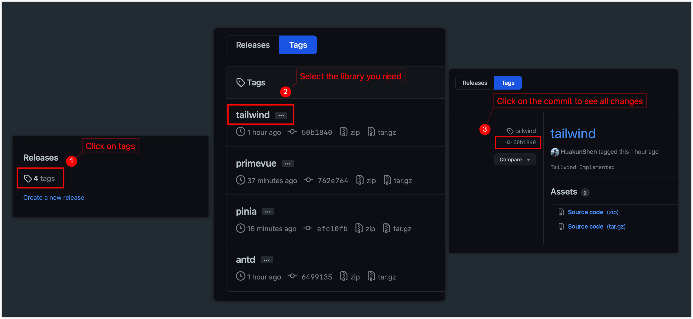

# Nuxt3-Starter

> This repo contains serveral demo for different libraries I use with Nuxt 3
> Installing libraries and plugins in Nuxt 3 is different from the methods for regular vue 3

## Introduction

Each library has a separate nuxt app to avoid confusion, so that you understand which configuration is for which library.

You could simply copy the folder and build upon it, but you may want to install multiple libraries, and you won't be 
using the lastest version of nuxt and other libraries. It's recommended to understand how the libraries are added.

I recommend you to read the `README.md` in each demo.

Or you can also look at the commit diff to see which lines of code are changed.

I made a tag for each library, find the commit for the tag then you will see the changes.

I may make changes to an existing library starter, in that code, you may want to find all the tags with the library name, I may tag them with versions. Using a graphical git tool may be a better option, such as GitLens and GitKraken. You can easily visualize historical changes and files using GitLens.

## Supported Libraries

Click on each link to read more details

1. [Ant Design Vue](./antd/README.md)
2. [Pinia](./pinia/README.md)
3. [PrimeVue](./primevue/README.md)
4. [Tailwind](tailwind/README.md)
